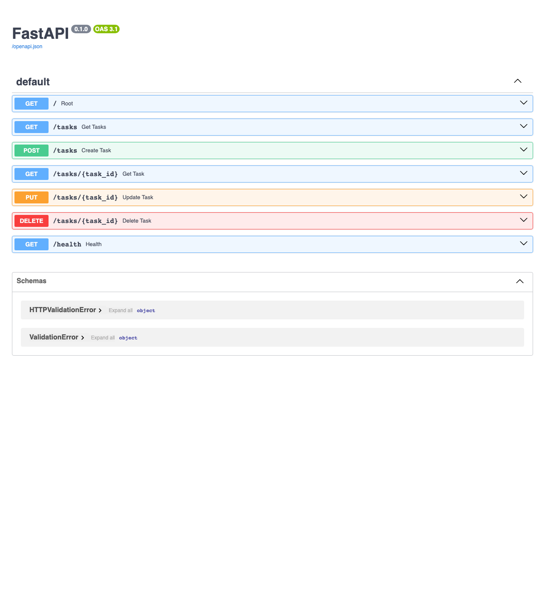

# Task API

A simple RESTful API for managing tasks built with FastAPI. This API provides full CRUD (Create, Read, Update, Delete) operations for a task list.

## Installation & Usage

To run the application:

```bash
source .venv/bin/activate && uv add requirements.txt && python3 -m uvicorn main:app --reload
```

The API will be available at `http://localhost:8000`.

## API Endpoints

| Method | Endpoint | Description |
|--------|----------|-------------|
| GET | `/` | Root endpoint with API information |
| GET | `/health` | Health check endpoint |
| GET | `/tasks` | Retrieve all tasks |
| GET | `/tasks/{task_id}` | Retrieve a specific task by ID |
| POST | `/tasks` | Create a new task |
| PUT | `/tasks/{task_id}` | Update an existing task |
| DELETE | `/tasks/{task_id}` | Delete a task |

## Example Usage

Here's an example of getting a task with ID 2:

```bash
curl -i http://localhost:8000/tasks/2
```

Response:
```
HTTP/1.1 200 OK
date: Wed, 15 Jul 2026 17:32:01 GMT
server: uvicorn
content-length: 37
content-type: application/json

{"id":2,"title":"Task 2","done":true}
```

## API Documentation

Interactive API documentation is available at:
- Swagger UI: `http://localhost:8000/docs`
- ReDoc: `http://localhost:8000/redoc`



## Development

This project uses:
- FastAPI 0.139.0+
- Uvicorn 0.51.0+
- Python 3.12+

Dependencies are managed with UV and can be found in `pyproject.toml`.