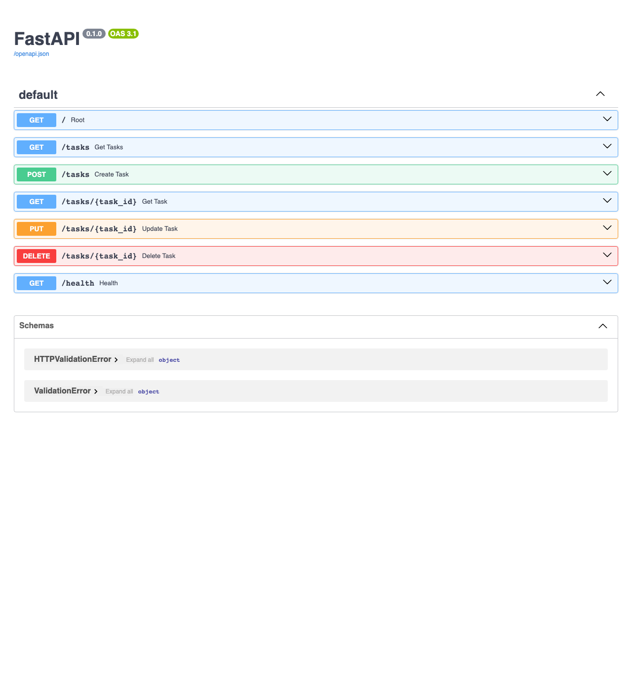
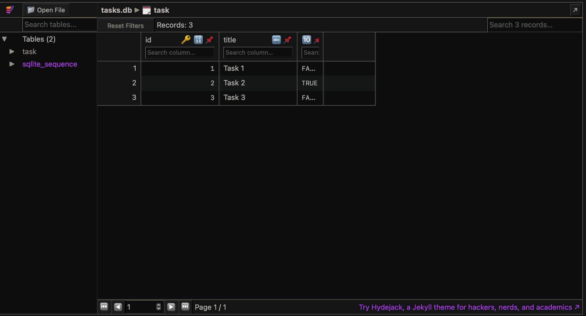

# Task API

A simple RESTful API for managing tasks built with FastAPI and SQLite. This API provides full CRUD (Create, Read, Update, Delete) operations for a task list with persistent storage.

## Quick Start

```bash
# Clone and run (one command)
uv run main.py
```

The API will be available at `http://localhost:8000`.

**What happens automatically:**
- Virtual environment created (if missing)
- Dependencies installed (`fastapi`, `uvicorn`, `sqlite3`)
- SQLite database `tasks.db` created automatically on first run
- `task` table created with 3 seed tasks
- Auto-reload enabled for development

No manual database setup or `uv sync` required — `uv run` handles everything.

## API Endpoints

| Method | Endpoint | Description |
|--------|----------|-------------|
| GET | `/` | Root endpoint with API information |
| GET | `/health` | Health check endpoint |
| GET | `/tasks` | Retrieve all tasks (supports `?done=true|false` and `?search=<text>` filters) |
| GET | `/tasks/{task_id}` | Retrieve a specific task by ID |
| POST | `/tasks` | Create a new task (JSON: `{"title": "string", "done": false}`) |
| PUT | `/tasks/{task_id}` | Update an existing task (JSON: `{"title": "string"}` and/or `{"done": boolean}`) |
| DELETE | `/tasks/{task_id}` | Delete a task |
| GET | `/stats` | Return counts: `{"total": N, "done": N, "open": N}` |
| POST | `/reset` | Restore the original 3 seed tasks (wipes all changes) |

## Example Usage

```bash
# List all tasks
curl http://localhost:8000/tasks

# Filter by completion status
curl "http://localhost:8000/tasks?done=false"

# Search by title
curl "http://localhost:8000/tasks?search=task"

# Get a single task
curl http://localhost:8000/tasks/1

# Create a task
curl -X POST http://localhost:8000/tasks \
  -H "Content-Type: application/json" \
  -d '{"title": "New task", "done": false}'

# Update a task (partial updates supported)
curl -X PUT http://localhost:8000/tasks/1 \
  -H "Content-Type: application/json" \
  -d '{"done": true}'

# Delete a task
curl -X DELETE http://localhost:8000/tasks/1

# Get stats
curl http://localhost:8000/stats

# Reset to seed data
curl -X POST http://localhost:8000/reset
```

## API Documentation

Interactive API documentation is available at:
- Swagger UI: `http://localhost:8000/docs`
- ReDoc: `http://localhost:8000/redoc`



## Project Structure

```
Task-1/
├── api.py          # FastAPI routes & business logic
├── db.py           # SQLite connection & initialization
├── main.py         # Entry point (uvicorn server)
├── tasks.db        # SQLite database (auto-created)
├── pyproject.toml  # Project metadata & dependencies
├── uv.lock         # Locked dependencies
└── README.md       # This file
```

## Development

This project uses:
- FastAPI 0.115+
- Uvicorn 0.32+
- Python 3.12+
- UV for package management

Dependencies are managed with UV and can be found in `pyproject.toml`.

### Run with auto-reload (development)

```bash
uv run uvicorn main:app --reload
```

## Persistence

Tasks are stored in a SQLite database (`tasks.db`), so they **survive server restarts**. The database is initialized automatically on first run with three seed tasks:

1. Task 1 — not done
2. Task 2 — done
3. Task 3 — not done



Use `POST /reset` to restore this initial state.